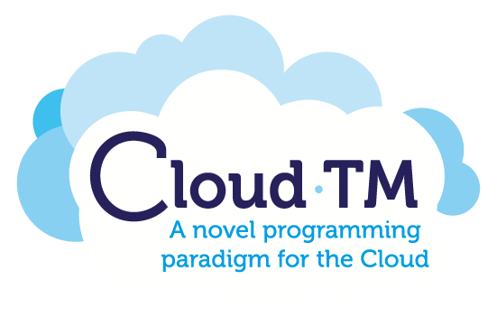

#Cloud-TM Autonomic Manager
This GitHub repository contains the source code, binaries and example applications associated with the Cloud-TM Autonomic Manager.

The current code base is associated with deliverable D3.4 of the <a href="http://www.cloudtm.eu">Cloud-TM project</a>.

This work was generated in the framework of the Specific Targeted Research Project (STReP) Cloud-TM, which is co-financed by the European Commission through the contract no. 257784.

 &nbsp;&nbsp;&nbsp;&nbsp;&nbsp;&nbsp;&nbsp;&nbsp;&nbsp;&nbsp;&nbsp;&nbsp;&nbsp;&nbsp;&nbsp;&nbsp;&nbsp;&nbsp;&nbsp;&nbsp;     

Copyright
============
The Cloud-TM Project is Copyright © 2010-2013 Cloud-TM Consortium. It is free software, and may be redistributed under the terms specified in the LICENSING.txt file.
